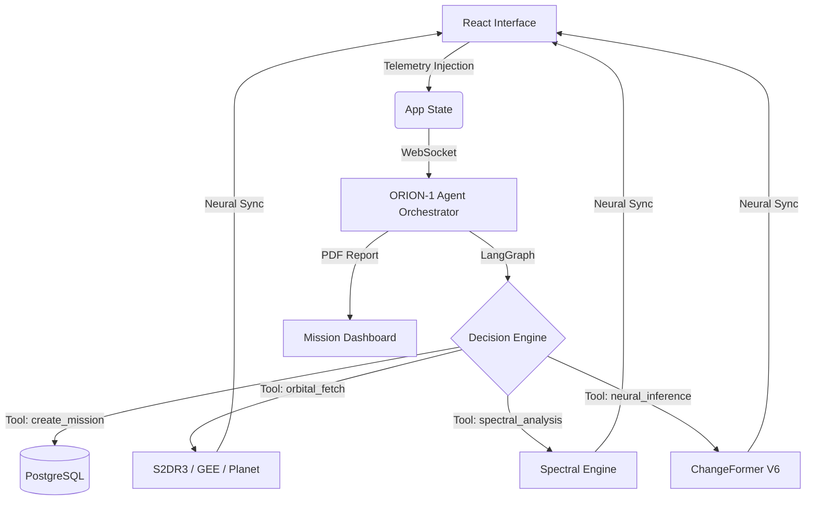

# 🛰️ UrbanEye v2.0 — Orbital Intelligence & Compliance Platform

**UrbanEye** is a professional-grade geospatial SaaS platform designed for high-precision urban monitoring, automated construction tracking, and environmental anomaly detection. 

The platform bridges the gap between raw satellite telemetry and actionable strategic intelligence by integrating **ORION-1**, an autonomous LangGraph-powered orchestrator, with **ChangeFormer V6** neural networks and a **GEE-Integrated Valid-Date Discovery** engine.

---

## 🏗️ 1. Latest Breakthroughs (v2.0)

UrbanEye has recently been upgraded with several industry-first geospatial features:

-   **📡 GEE Valid-Date Discovery**: A new 5-step guided pipeline that queries Google Earth Engine to identifying cloud-free scenes between **2015 and 2026** for any AOI.
-   **📑 Enhanced Intelligence Dossier**: Completely overhauled PDF reporting engine featuring:
    -   2-column spectral heatmap galleries.
    -   AI-generated strategic assessments (Executive Summary, Risk Factors, Compliance Audit).
    -   Mean-value index distribution tables and impact metrics.
-   **🔄 Step-by-Step UI Synchronization**: The ORION agent now operates in a strict human-in-the-loop mode, explaining each tool's result and announcing exactly where data has "Loaded in UI" across the dashboard, spectral, and CD pages.
-   **🛰️ Multi-Spectral Ingestion**: Mission fetch tools now ingest both TCI (Visual) and Multispectral (Scientific) bands in a single orbital sync event.

---

## 🏗️ 2. Neural Orchestration Architecture

UrbanEye utilizes an event-driven "Single Source of Truth" architecture centered around the **ORION-1 intelligence engine**:

-   **ORION-1 Autonomous Brain**: Powered by LangGraph and Llama-3.3-70B (Groq). Controls the full 8-phase mission lifecycle.
-   **Neural Dashboard Sync**: Real-time WebSocket triggers that force the frontend to refresh imagery and spectral data as soon as the agent completes a tool call.
-   **Tactical Human-in-the-Loop**: ORION now asks for explicit permission (e.g., "Should I proceed with the T2 fetch?") before every major pipeline stage.

---

## 🧠 3. Analytical Intelligence Layer

The platform's predictive power is driven by state-of-the-art transformer models and scientific multi-spectral analysis.

-   **ChangeFormer V6**: A Siamese Transformer architecture that detects pixel-level differences between T1 and T2 epochs, filtered for urban structural changes.
-   **Spectral Engine**: Computes 6 core scientific indices with user-legible heatmaps:
    -   **NDVI & EVI**: Vegetation density and agricultural health.
    -   **NDBI & BSI**: Built-up density and bare-soil construction indicators.
    -   **NDWI & MNDWI**: Moisture levels and water boundary tracking.

---

## 🏗️ 4. Code Repository Structure

UrbanEye is a modular, high-performance platform:

### 🛰️ Backend (UrbanEye Ground Station)
- `backend/ai_agent/`: **The ORION brain.** Contains `agent.py` (LangGraph), `tools.py` (Orbital Tools), and `state.py`.
- `backend/app/api/`: REST & WebSocket endpoints (Fetch, Reports, Status, valid-dates).
- `backend/app/pipelines/`:
    - `changeformer.py`: Neural CD inference logic.
    - `s2dr3.py` / `gee.py` / `planet.py`: Provider-specific acquisition logic.
- `backend/app/services/`: AI Narrative engine and PDF Dossier Generator.

### 🍱 Frontend (Interactive Neural Command - v2)
- `frontend1/`: High-end React application featuring a map-centric UI and glassmorphism styling.
  - `src/components/pages/`:
    - `OverviewPage.js`: Executive summary, interactive image sliders, and architecture diagrams.
    - `FetchPage.js`: Mission setup with dynamic map-collapse transitions.
    - `ChangeDetectionPage.js`: Siamese Transformer output viewer with footprint statistics.
    - `IndexValidationPage.js`: Spectral analysis with dedicated zoomed views and heatmap grids.
    - `CompliancePage.js`: Rule management and full PDF export capabilities.
    - `AgentPage.js`: ORION AI conversational interface with direct pipeline hook-ins.

---

## ⚙️ 5. Technical Requirements & Setup

### Prerequisites
- **Python 3.12+**
- **Node.js 18+**
- **PostgreSQL 14+**
- **NVIDIA GPU (8GB+ VRAM)** (Required for ChangeFormer inference)

### Installation & Ignition
1.  **Initialize DB**: Execute `backend/check_db_v3.py` to ensure schema integrity.
2.  **Environment Setup**: Configure `backend/.env` with your GROQ, GEE, and Planet API keys.
3.  **Ignition**: Run `start_all1.bat`. This handles backend setup, frontend1 dependencies, and starts both servers.

---
© 2026 UrbanEye Geospatial Intelligence. Autonomous Orbital Reconnaissance & Strategic Compliance.
