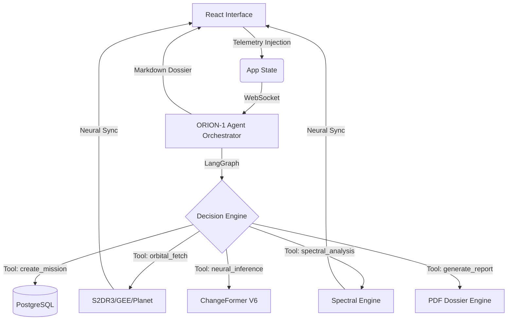

# 🛰️ UrbanEye — AI-Powered Satellite Intelligence & Compliance Platform

**UrbanEye** is a professional-grade geospatial SaaS platform designed for high-precision urban monitoring, automated compliance enforcement, and longitudinal change analysis. 

The platform bridges the gap between raw satellite data and actionable urban insights by integrating **ORION-1**, an autonomous LangGraph-powered orchestrator, with **Deep Siamese Transformers** (ChangeFormer V6) and a **Multi-Spectral Validation Engine**.

---

## 🏗️ 1. Neural Orchestration Architecture

UrbanEye utilizes a sophisticated, event-driven architecture centered around the **ORION-1 AI Agent**:

- **ORION-1 Autonomous Brain**: Powered by LangGraph and Groq (Llama-3/Gemma), managing the full 8-phase GEOINT lifecycle.
- **Neural Dashboard Sync**: Real-time WebSocket bridge that updates the Dashboard imagery and loading bars as the agent works autonomously.
- **Human-in-the-Loop Bridge**: Allows commanders to manually select AOIs and dates on the map and "Transmit" those parameters directly to the agent's reasoning cycle.

---

## 🧠 2. ORION-1: Autonomous Mission Control

The core intelligence layer, **ORION-1**, executes complex multi-step geospatial missions with minimal human intervention.

### 🔬 Operational Protocols
1.  **Telemetry Ingestion**: Ingests hand-drawn AOIs and temporal windows from the map dashboard.
2.  **Mission Configuration**: Automatically registers missions, searches for optimal orbital scenes, and maintains a persistent memory of the chat and mission state.
3.  **Tactical Visualization**: Communicates using a structured Markdown protocol, providing real-time tool logs and detailed data tables directly in the Mission Control chat.
4.  **Autonomous Orchestration**: Triggers imagery fetches, index computations, and neural inference through a series of specialized orbital tools.

---

## 🏗️ 3. ChangeFormer V6 & Spectral Intelligence

The platform's analytical power is driven by state-of-the-art transformer models and scientific multi-spectral analysis.

### 🛰️ Detection Capabilities
- **Siamese Transformers**: ChangeFormer V6 utilizes multi-head self-attention to understand global structural context, differentiating true urban change from seasonal shifts.
- **Spectral Validation Engine**: Computes 10+ scientific indices in real-time:
    - **NDVI & EVI**: High-precision vegetation and agricultural health monitoring.
    - **NDBI & BSI**: Detection of new urban build-ups and bare soil for construction prediction.
    - **NDWI & MNDWI**: Tracking of water bodies and wetland encroachment.

---

## 📊 4. Intelligence Deliverables

UrbanEye focuses on professional grade, verifiable evidence:
- **Real-time Neural Terminal**: Live logs from the Transformer inference engine.
- **Automated PDF Dossiers**: Professional intelligence reports generated via `reportlab`, containing mission statistics, spectral graphs, and high-resolution binary masks.
- **Side-by-Side Validation**: Interactive visual comparison layers for baseline (T1) and monitoring (T2) epochs.

---

## 🏗️ 5. Code Repository Structure

UrbanEye is a modular, industrial-grade intelligence platform:

### 🛰️ Backend (UrbanEye Ground Station)
- `backend/ai_agent/`: **The ORION brain.** Contains the LangGraph definition (`agent.py`), tactical tools (`tools.py`), and neural state persistence.
- `backend/app/api/`: REST & WebSocket endpoints for mission orchestration and real-time telemetry.
- `backend/app/core/`: Database connection pools and central configuration.
- `backend/app/pipelines/`: **Proprietary Intelligence Engines.**
    - `changeformer.py`: Siamese Transformer inference logic.
    - `s2dr3.py` / `planet.py`: Satellite-specific acquisition pipelines.
- `backend/app/services/`: Auxiliary logic including the PDF Dossier Generator.
- `backend/data/`: Structured storage for high-resolution imagery and AI-generated masks.

### 🍱 Frontend (Neural Dashboards)
- `frontend/src/App.js`: **Central Nervous System.** Manages global persistence, chat history, and mission polling.
- `frontend/src/components/pages/`:
    - `AgentPage.js`: AI Mission Control interface with Markdown rendering.
    - `FetchPage.js`: Leaflet-based AOI selector and imagery retrieval dashboard.
    - `OverviewPage.js`: Longitudinal side-by-side comparison interface.
- `frontend/src/components/sidebar/`: Tactical navigation and mission job-status monitors.
- `frontend/src/utils/api.js`: Standardized Axios wrappers for the geospatial API.

---

## ⚙️ 6. Technical Requirements & Setup

### Prerequisites
- **Python 3.10.11** (Tested for Siamese compatibility)
- **Node.js 18+** (React 18 Architecture)
- **PostgreSQL 14+** (Persistent Checkpointing)
- **NVIDIA GPU (8GB+ VRAM)** (Required for ChangeFormer V6)

### Installation & Ignition
1.  **Initialize DB**: Execute `backend/check_db_v3.py` to ensure schema integrity.
2.  **Environment Setup**: Configure `backend/.env` with your GROQ, GEE, and Planet API keys.
3.  **Ignition**: Run `start_all.bat`. This handles venv creation, dependency sync, and starts the asynchronous mission orchestrators.

---
© 2026 UrbanEye Geospatial Intelligence. Autonomous Orbital Reconnaissance & Compliance.
