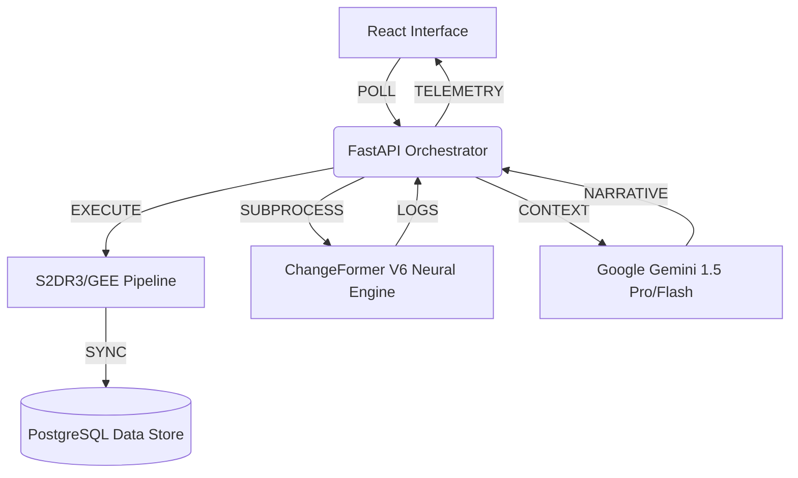

# 🛰️ UrbanEye — AI-Powered Satellite Intelligence & Compliance Platform

**UrbanEye** is a professional-grade geospatial SaaS platform designed for high-precision urban monitoring, automated compliance enforcement, and longitudinal change analysis. 

The platform bridges the gap between raw satellite data and actionable urban insights by integrating **Deep Siamese Transformers** (ChangeFormer V6) with a **Multi-Spectral Validation Engine**. It is built for urban planners, environmental auditors, and compliance officers who require verifiable evidence of urban shifts over time.

---

## 🏗️ 1. High-Level Architecture

UrbanEye utilizing a highly decoupled, asynchronous architecture to manage computationally expensive geospatial operations:

- **Frontend (React 18)**: Manages mission state and handles complex Leaflet-based AOI drawing.
- **Backend (FastAPI)**: Serves as the mission orchestrator, routing data between imagery sources, the neural engine, and the database.
- **Database (PostgreSQL)**: Stores mission metadata, spectral index statistics, and compliance rules.
- **Data Dir (Local)**: A structured directory (`/data/{project_id}`) that stores high-resolution TIFs, PNG previews, and AI masks.

---

## 🧠 2. Deep Dive: ChangeFormer V6 Detection Model

The core of UrbanEye’s intelligence is the **ChangeFormer V6** model, a state-of-the-art transformer-based Siamese network designed specifically for change detection in high-resolution remote sensing imagery.

### 🔬 How it Works (The Science)
Unlike traditional "Difference Imaging" which just subtracts pixels, ChangeFormer understands **structural context**:

1.  **Siamese Architecture**: The model takes two inputs (T1 and T2). It passes them through a **Shared Encoder** (Siamese branch). This ensures the model treats both time points with identical feature extraction logic.
2.  **Transformer Encoders**: Traditional CNNs look at local pixel clusters (3x3, 5x5). ChangeFormer uses **Multi-Head Self-Attention**, allowing it to see **global dependencies**. For example, it can recognize that a new building in T2 is part of a larger construction project hundreds of meters away.
3.  **Difference Module**: The model identifies feature discrepancies between T1 and T2 at multiple scales (Low-level textures vs High-level objects).
4.  **Prediction Head**: Outputs a binary classification for every pixel (0: No Change, 1: Change).

### ⚙️ Inference Pipeline Details
To run this model on consumer GPUs with high-resolution imagery, UrbanEye implements a custom **Tiled Inference Engine**:

- **Input Normalization**: All imagery is converted to Float32 and normalized using **ImageNet Statistics** (`mean=[0.485, 0.456, 0.406], std=[0.229, 0.224, 0.225]`). This aligns the input with the model's pre-trained weights for maximum accuracy.
- **Patch Extraction (256x256)**: The image is divided into tiles. To prevent "boundary noise" where the model cuts off an object, we use a **224px stride**, creating a 32-pixel overlap.
- **Argmax Decoding**: The model outputs logits for the "Change" and "No Change" classes. We use `torch.argmax` to select the most probable class for every pixel, creating a high-contrast binary mask.
- **Telemetry Stream**: Inference logs are captured via standard output and streamed to the UI, showing exactly how many "change pixels" are found in each tile in real-time.

---

## 📊 3. Deep Dive: Spectral Validation Engine

Before running AI, UrbanEye validates environmental health using the **Spectral Validation Engine**. It analyzes 10+ bands from Sentinel-2/GEE satellites to compute scientific indices:

| Index | Spectral Formula | Urban Significance |
|---|---|---|
| **NDVI** | `(NIR - Red) / (NIR + Red)` | Tracks vegetation health. Values < 0 indicate build-up or loss. |
| **NDBI** | `(SWIR1 - NIR) / (SWIR1 + NIR)`| Detects asphalt and concrete. Essential for identifying urbanization. |
| **NDWI** | `(Green - NIR) / (Green + NIR)`| Identifies open water. Tracks wetland encroachment. |
| **MNCWI**| `(Green - SWIR2) / (Green + SWIR2)`| Optimized for urban areas. Differentiates ponds from asphalt shadows. |
| **BSI**  | `((SWIR1 + Red) - (NIR + Blue)) / ((SWIR1 + Red) + (NIR + Blue))` | Highlights bare soil. Predicts upcoming construction phases. |
| **EVI**  | `2.5 * ((NIR - Red) / (NIR + 6*Red - 7.5*Blue + 1))` | High-precision green-space analysis for dense canopy verification. |

**Processing logic**: We use `rasterio` and `numpy` to perform these operations directly on the 10m/20m multi-spectral arrays, generating 8-bit color-mapped PNGs for the dashboard.

---

## ⚙️ 4. Mission Setup & Requirements

### Technical Prerequisites
- **Python 3.10.11**: Specifically tested for library compatibility.
- **Node.js 18+**: For the React polling architecture.
- **PostgreSQL 14+**: Stores mission metadata and telemetry logs.
- **NVIDIA GPU (8GB+ VRAM)**: Required for the Transformer-based inference at reasonable speeds.

### Essential API Keys & Credentials
UrbanEye requires three key "fuel sources" to operate:
1.  **Google Gemini API Key**: Used for the **Narrative Synthesis**. It takes the spectral stats and CD magnitude to write a human-readable report.
2.  **GEE Service Account JSON**: Required for the **Earth Engine Pipeline**. Place this in the root or set the path in `.env`.
3.  **Planet Labs API Key**: (Optional/Integration Ready) Used for high-frequency daily revisits.

### Launching the Ground Station
1.  **Initialize DB**: Execute `scripts/init_db.sql`.
2.  **Environment Setup**: Populate `backend/.env` with your Keys.
3.  **Ignition**: Run `start_all.bat`. This handles venv creation, dependency sync, and starts both servers.

---

## 🕵️ 5. The Professional Workflow

1.  **AOI Strategic Selection**: Use the Leaflet-Draw tools to select your survey boundary.
2.  **Baseline Retrieval**: The platform fetches T1 and T2 imagery in parallel. Observe the **Spectral Decoding** animation as the platform computes indices.
3.  **Intelligence Initiation**: Once you verify the TCI quality, click **"INITIATE CHANGE DETECTION"**. The ChangeFormer model will initialize on your GPU.
4.  **Log Monitoring**: Watch the **Neural Terminal**. If it reports `0 changed pixels`, the imagery is likely too saturated or no change occurred.
5.  **Final Synthesis**: Once the mask is ready, Google Gemini analyzes the pixel density and spectral shifts to provide a final **Mission Insight Report**.

---
© 2026 UrbanEye Geospatial Intelligence. Professional Grade Remote Sensing & Compliance.
